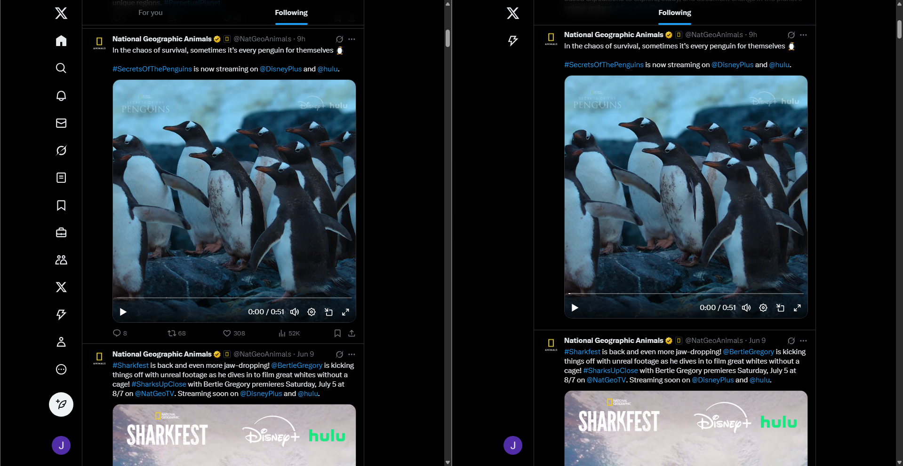
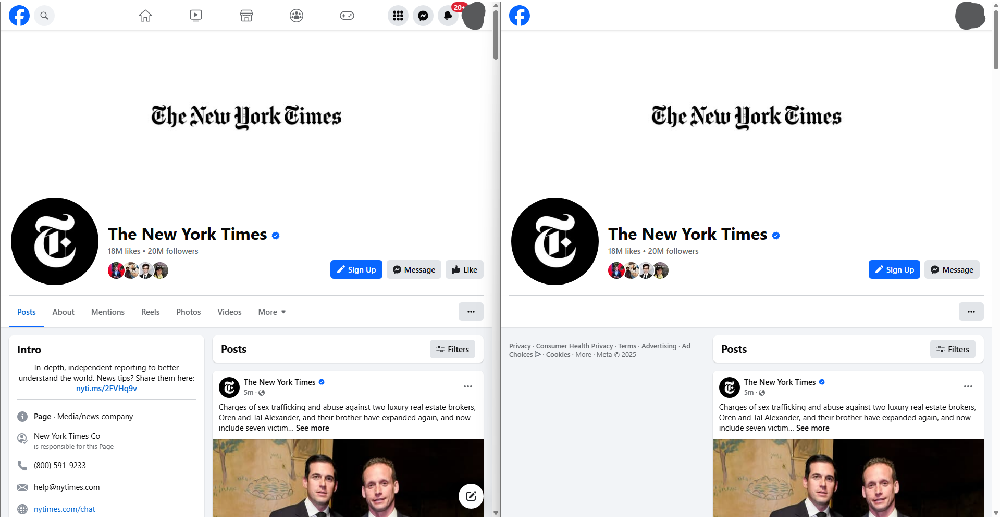
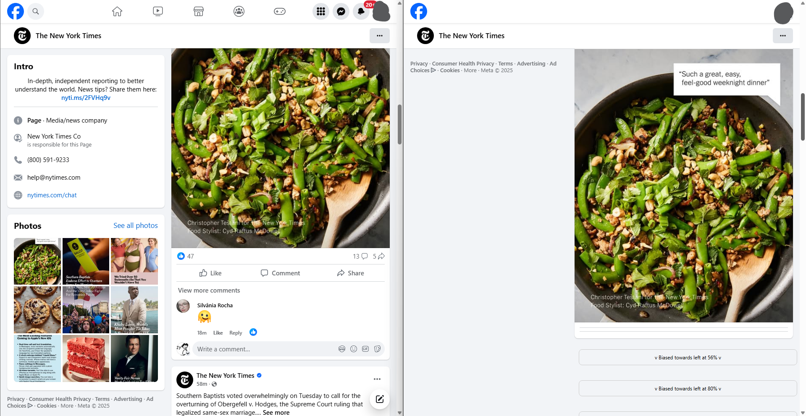
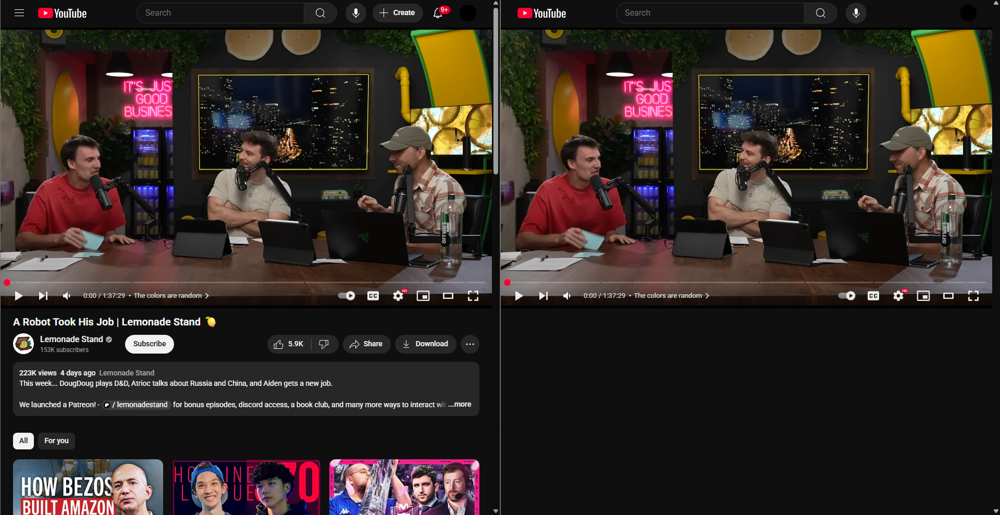

# Chronode

An extension for chromium based browsers (e.g. Chrome, Edge, Opera, or Brave) which aims to remove distractions, promote less scrolling, encourage better use of social media and help you get your time from social media sites. 

I encourage anyone to contribute (:

Feel free to send me suggestions or questions via [email](https://johnsony0.github.io/contact), or for bug reports create a GitHub [issue](https://github.com/johnsony0/productivity-extension/issues).

---

## Table of Contents

- [Users](#users)
  - [Installation](#installation)
  - [Examples](#examples)
  - [Features](#features) 
  - [Settings Explained](#settings-explained)
- [Devs](#devs)
  - [Setup and Structure](#setup-and-structure)
  - [Known Problems](#known-problems)
  - [ML/AI Model](#mlai-model)
- [Safety and Sustainability](#safety-and-sustainability)
- [Acknowledgements](#acknowledgements)
---

## Users

### Installation
- Regular
  - Install from the [Chrome Web Store](insertlink) 
  - Configure Settings
- Early Releases
  - Download most recent release on this repo
  - Unzip file
  - On the [Chrome Extensions Page](chrome://extensions/)
  - Turn on developer mode (top right)
  - Click load unpacked (top left)
  - Select the unzipped dist folder
- Most Recent Version
  - Download the repo
  - Follow guide for [setup](#setup-and-structure)
  - pnpm run build for the dist folder
  - Follow steps 2-6 from Early Releases

### Examples








> On each image, left shows before and right shows after the extension is applied. Some features listed below can be seen. 

### Features
- Flexible Settings 
- Quick Select Settings 
- Dark Mode 
- Timeouts
- Hiding Navigation Tools
- Remove Reactions and Comments
- Filter Politically Biased Posts
- Set Posts Limit Per Day
- Hide Notifications and Messages
- Delete Suggested Videos/Friends Section
- Remove Short Form Content
- Further Modifications like Greyscale and Hiding Images/Videos
- Exempt Pages
- Basic Stats

### Settings Explained
- Quick Settings 
  - Slider: Adjust how strict the extension is, with 1 being the loosest, and 5 being extremely strict. The more strict, the more functionality is removed.
  - Toggles: Some common settings that are important like search and messages are toggleable for easy access.
- Extension
  - Timeout: A timer whenever you open extension settings. Made to deter the user from just increasing post limits or decreasing strictness frequently.
  - Disable Navigation: Removes all redirects on the page
  - Gresyscale: Turns the page black & white
  - Limit Posts: The amount of posts the user can see in a day. Resets 12:00am in your local time zone.
  - Topic: Classification model to filter topics the user does not want to see. In beta right now, needs to be improved before general usage. Turned off by default.
  - Bias: Classification model to filter biased posts. If a post is leaning left or right by a value greater than threshold, the post will be filtered. In beta as well, works decently, but needs improvement as well. 
- Site Specific (Facebook, Instagram, Twitter, YouTube)
  - Timeout: A timer for that specific site, to deter you from entering the site to begin with.
  - Pages Exempt: Allows you to exempt certain pages from being filtered, such as exempting family or friends or news you truly need. The entire path is required so for facebook.com/nytimes, add /nytimes to the list. 
  - Navigation: Consists mainly of sidebars and navigation bars, but largely any tools that the site uses to redirect you to other parts of the site.
  - Home: Home page or for you page
  - Pages: Profiles of other people or channels
  - Groups: Exclusive to Facebook, for Facebook groups

---

## Devs

### Setup and Structure

This extension was built using a template managed by [Jonghakseo](https://github.com/Jonghakseo/chrome-extension-boilerplate-react-vite/tree/main), and mostly stays true to their boilerplate in terms of setup and structure. They describe installation, dependencies, environment variables, and more at far greather length than I ever can.

For setup and structure information, please read their [ReadMe](https://github.com/Jonghakseo/chrome-extension-boilerplate-react-vite/tree/main?tab=readme-ov-file#installation). 

Slight modifications to structure are reflected below.


- ml/ai models - [chrome-extension/public](chrome-extension/public) 
- ml/ai code - [model_creation](model_creatin)
- content.js helpers - [shared](packages/shared)
- setting configurations - [storage](packages/storage)

### Known Problems

* If you get an error indicating that Port 8081 is already being used, try the following for Windows: 
```bash
netstat -ano | findstr :8081
TCP    0.0.0.0:8081    0.0.0.0:0    LISTENING    1234
taskkill /PID 1234 /F
```

### ML/AI Model

For contribution and information regarding the AI/ML portion, check out our AI/ML [documentation](model_creation/README.md). 

---

## Safety and Sustainability

### Costs

Everything runs locally. We don't pay for a database or a website and thus have no costs associated with running the extension. This ensures we can run at no cost to you. 

### Data

Consequently, as we have no databases and everything including our ML/AI models are run locally, your data never leaves your computer when using our extension!

### Computing Costs

Noticeably, the downsides of localizing our models is that the ML/AI models will take up your computing resources (such as CPU time and memory). As such we aim to minimize the models through techniques like pruning and quanitization so it consumes as little as your resources as possible. If you struggle with running our models or wish to not use it, you can disable all our models in settings.

---

## Acknowledgements

Huge thanks to [Jonghakseo](https://github.com/Jonghakseo/chrome-extension-boilerplate-react-vite/tree/main) and the contributors to his repo for their amazing boilerplate!