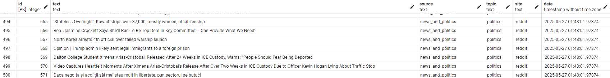
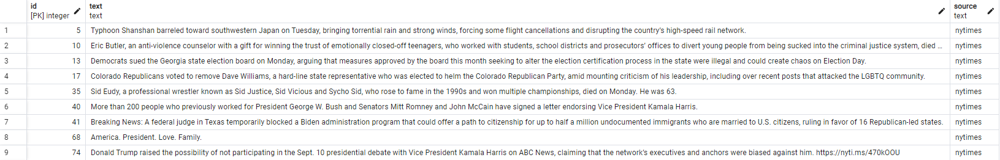

# ML/AI Engine Deep Dive: Your Project Name

This document details the data collection, processing, training procedures, final models and deployment strategies used in Chronode.

---

## Table of Contents

- [Intro](#intro)
- [Topic](#topic)
    - [Data Collection](#collection)
    - [Processing Data](#processing)
    - [Training Pipeline](#training-pipeline)
    - [Model Architecture](#model-architecture)
- [Bias](#bias)
    - [Data Collection](#collection-1)
    - [Processing Data](#processing-1)
    - [Training Pipeline](#training-pipeline-1)
    - [Model Architecture](#model-architecture-1)
- [Future](#future)

---

## Intro

As our models are used on social media sites, we need a classification model primarily trained on shorter texts like Facebook posts or Reddit posts. A popular model for such a task (predicting bias and topics of a short post) does not exist so we opted to build our own.

The scripts for [bias data](data/collect_bias_data.ipynb) and [topics data](data/collect_topic_data.ipynb) can be found in the data folder. 

---

## Topic

### Collection

For topic data we collected text, source, topic, website and date. The data predominantly comes from Reddit, through subreddits or topic pages. For instance the tech subreddit or the world news topic page. As some data here still comes from Facebook, we separate the two through keeping track of website. 

### Processing

### Training

### Architecture

---

## Bias

### Collection
For bias data we collected text and their source from the Facebook pages of prominent news sites such as NYT, BBC, or Fox. The data is stored into a local PostgresDB as shown below. 

We intend to store the date when we received the data in the near future. 

### Processing

NYT for left leaning news, BBC for central leaning news and Fox for right leaning.
[allsides media bias chart](https://www.allsides.com/media-bias/media-bias-chart). 

### Training

### Architecture

---

## Future

As the way we speak, consume, and create news gradually change over time. Politics, the people involved, the things that matter most to voter, and the state of the world also changes over time. As such the model has to be constantly retrained on newer data to keep up to date with how the left and right approach news and politics. 